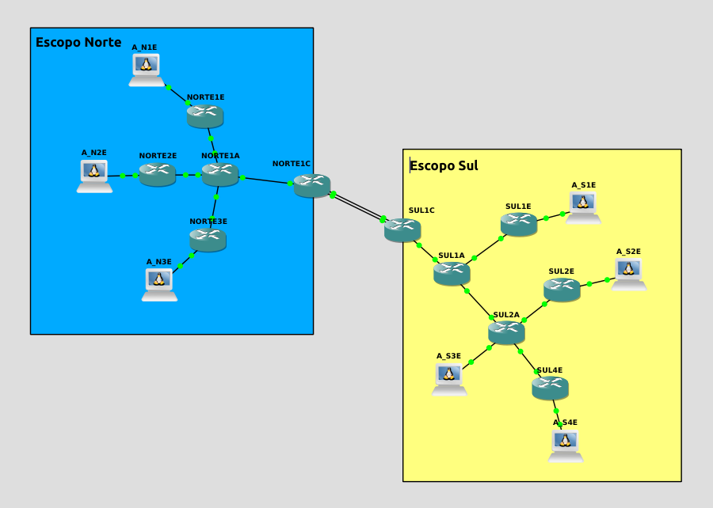

## Introdução

A ferramenta auxilia na configuração básica de equipamentos de rede emulados no GNS3 ou EVE-NG.


## Pré Requisitos
* Sistema operacional [Unix](https://pt.wikipedia.org/wiki/Unix)
* [python](https://www.python.org/download/releases/3.0/) - acima da versão 3.6
    * [Módulo PyYaml](https://pypi.org/project/PyYAML/) - acima da versão 5.3
    * [Módulo ipaddress](https://pypi.org/project/ipaddress//) - acima da versão 1.0

### Instalação das Dependências
Para instalação do PyYaml e do ipaddress utilizaremos o gerenciador de pacotes [PIP3](https://pip.pypa.io/en/stable/):
```sh 
pip3 install PyYaml
pip3 install ipaddress
```
Ou simplesmente importaremos o [arquivo]() que configura o ambiente:
```sh 
pip3 install -r requirements.txt
```


## Config.YAML
Arquivo de configuração onde os parâmetros de cada escopo de rede sub-rede e equipamento são definidos.

Sua localização padrão é na raiz do projeto, sempre com nome 'routers.yaml'.

Este arquivo é dividido em três partes principais, `basic`, `network` e `routers`.

Obs: Todas as configurações usadas no exemplo seguem o seguinte laboratório:



### Basic

Exemplo da sessão basic:

```yaml
basic:
    - script_file: '../basics.ios'
    - server_ip: '192.168.0.101'
    - password: 'cisco'
    - debug: True
```

* script_file - Caminho do script IOS com as configurações básicas a serem aplicadas nos roteadores.
  *  - Coringa para a hostname do router.
  *  - Coringa para a senha padrão do projeto.
* server_ip - Endereço de IP do servidor GNS3 ou EVE-NG.
* password - Senha padrão a ser aplicada nos equipamentos.
* debug - Valor booleano para exibição dos passos em tela durante execução.

### Networks

Formato da sessão networks:

```yaml
networks:
    - NOME_DO_ESCOPO:
        - address: REDE/MASCARA
        - subnets:
            - SUBREDE/MASCARA
```


* NOME_DO_ESCOPO - Nome global do escopo de rede a ser criado.
* address - Endereço global da rede.
  * REDE - Endereço de IP global da rede.
  * MASCARA - Máscara global da rede (inteiro).
* subnets - Lista das sub-redes a serem calculadas dentro do escopo global.
  * SUBREDE - Nome (str) da sub-rede
  * MASCARA - Máscara (inteiro) da sub-rede.

Exemplo de configuração:

```yaml
networks:
    - NORTE:
        - address: 172.18.0.0/16
        - subnets:
            - NORTE1/30
            - NORTE2/30
            - NORTE3/30
            - NORTE4/30
            - NORTE5/30
```

### Routers

Formato da sessão routers:

```yaml
routers:
    - NOME_DO_ROTEADOR:
        gns_port:
        ios: 
        scope:
        network:
            - NOME_DA_INTERFACE_DE_REDE:
                ip: 
                description: 
        script_file: 
```

* NOME_DO_ROTEADOR - Nome do roteador a ser configurado.
* gns_port - Porta do servidor GNS/EVE-NG que responde pelo roteador declarado.
* ios - Versão do sistema operacional do roteador *(sem uso no momento)*
* scope - Nome do escopo de rede que o router pertence.
* network - Definições gerais de rede:
  * NOME_DA_INTERFACE_DE_REDE - Nome exato utilizado na NIC do equipamento.
  * ip - Nome da sub-rede declarada na sessão Networks.
  * description - Descrição da interface de rede do roteador.
* script_file - Arquivo de saída onde o script de configuração é salvo.

Exemplo de configuração:

```yaml
routers:
    - NORTE1A:
        gns_port: 5002
        ios: 'C7200'
        scope: 'NORTE'
        network:
            - FastEthernet0/0:
                ip: LINUX1/24
                description: CONEXAO COM LINUX
        script_file: './cisco/NORTE1A.ios'
```


## Uso da Ferramenta

Após clonar o projeto, instalar as dependências, criar e iniciar o laboratório no emulador desejado e configurar o arquivo routers.yaml, basta executar o módulo python.

```sh
$ python3.6 -m router-config
```